# Building a UI layer

Now that we have a working API, let's deploy a UI that can expose this
functionality to our users.  Note that we will only deploy this UI in our *Primary*
region (Ireland).  We don't attempt to address failing over a full web application in this
workshop.  Our failover efforts are focused on the backend API components deployed
in the first module.

Navigate to the `2_UI/cfn` folder in your local Git repository.

## 1. Create the AWS Cognito Identity Pool, S3 bucket and Cloudfront distribution

Our first task is to setup AWS Cognito to allow our UI application to
authenticate users and gain permission to call the API. As in *Module 1*, a CloudFormation template is available to create all the
necessary resources for us.

For time reasons we are not providing console instructions for this section.  Do
feel free to review the CloudFormation template to see what is being created.

You can go ahead and deploy this template in the primary region (Ireland) using the `aws
cloudformation deploy` CLI command as before.

For the Ireland region, execute this command to enter the correct subdirectory:

    cd /home/ec2-user/environment/MultiRegion-Serverless-Workshop/2_UI/cfn

The full command will look like:

    aws cloudformation deploy \
    --region eu-west-1 \
    --template-file web-ui-stack.yaml \
    --stack-name ticket-service-ui \
    --capabilities CAPABILITY_IAM

Again, you can confirm that this was created successfully and see the resource
in the AWS Console. Navigate to the CloudFormation service and take a look at
the *Outputs* tab. This time you will see these keys:

* `CognitoIdentityPoolId`
* `BucketName`
<!-- * `BucketURL` -->

Take note of the values for each of these, you will need them in the next steps.

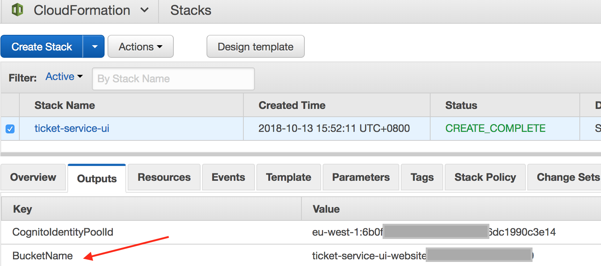

#### Cloudfront distribution for S3 bucket
Next, we need to create a Cloudfront distribution for the S3 bucket that we created above (Step 1):

    aws cloudformation deploy \
    --region eu-west-1 \
    --template-file webs3bucket_with_cloudfront.yaml \
    --stack-name ticket-service-ui-cloudfront \
    --parameter-overrides S3BucketName=[bucket-name]

Note that you must replace `[bucket-name]` in this command with the `BucketName` output from the CloudFormation stack in step 1. . It typically takes about 15 minutes for the CloudFormation stack creation to finish. You can move forward to configure Cognito and Facebook Developer ID.

## 2. Configure Federated Identities with Cognito

Now we'll set up our login with Facebook capability, this allows any Facebook users to login to our application. 

Go into your Facebook Developer account and create an new application by
[following these steps](https://developers.facebook.com/apps/).

Click on **Add a New App** in the upper right corner: 

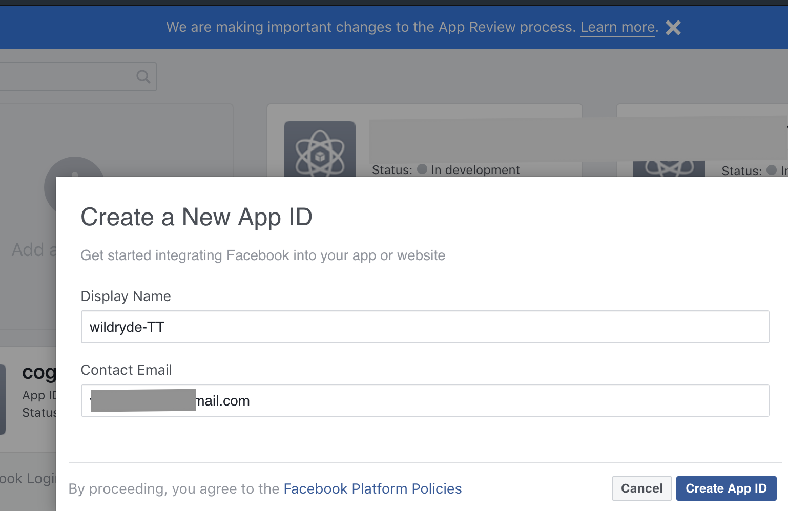

Name your App anything you would like, and then click **Create App ID**. (Take note of the App ID)

Once you have created your App, you will need to select *Settings* -> *Basic* from the left menu.

<!-- 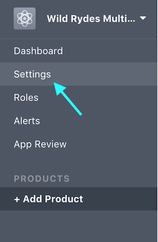 -->

Next choose **Add Platform** from the bottom of the Settings screenshot:

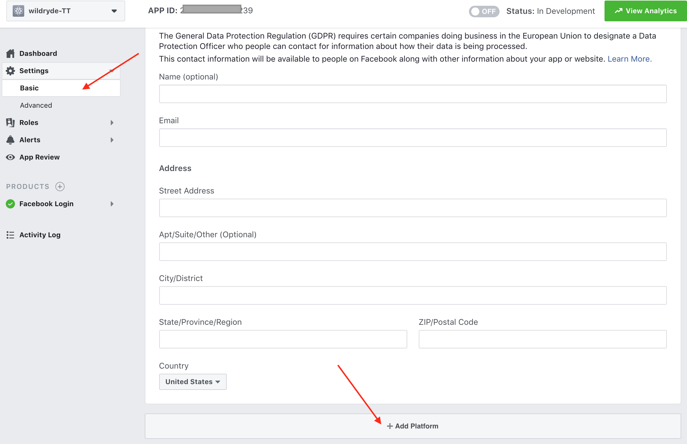

Choose **Website** from the list of choices that comes up:

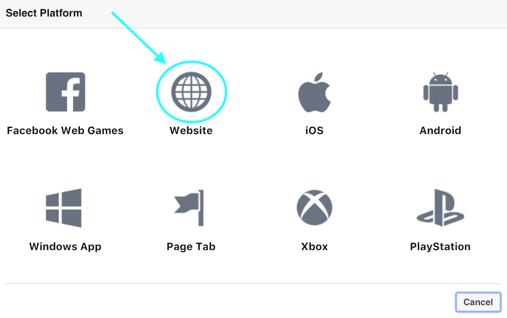

Then enter the Cloudfront URL (this is the CloudFormation output - `CfDistributionDomainNameWithOAI` from the `ticket-service-ui-cloudfront` stack you deployed in earlier steps in this module) into the *Site URL* dialog
and then select **Save Changes** from the lower right.
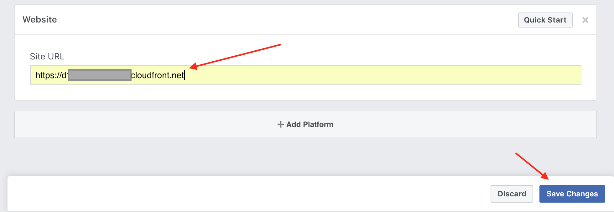

Once you are done with this, make note of the Facebook App ID - you will need this
in the next step as well as when you build the website code in the next section.

<!-- 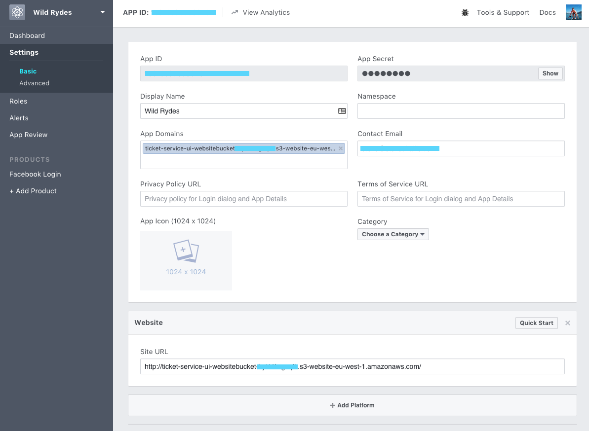 -->

#### Cognito Identity Pool with Facebook as identity provider
Next, we must configure the Cognito Identity Pool to use Facebook as our
identity provider. To do this, open up the AWS Console in your browser and
navigate to Cognito from the menu. Double check that you are still in the
primary region (Ireland).

1. Choose **Manage Identities Pools** and select the `SXRIdentityPool`.
2. Click the **Edit Identity Pool** button in the top right
3. Take note of the `Identity pool ID` noted at the top of this page (You can find this ID in the outputs of `ticket-service-ui` CloudFormation stack)
4. Navigate to the **Authentication Providers** section.
5. Select the **Facebook** tab, hit Unlock then specify your Facebook App ID (15 digits number)
6. Save Changes at the bottom of the page.

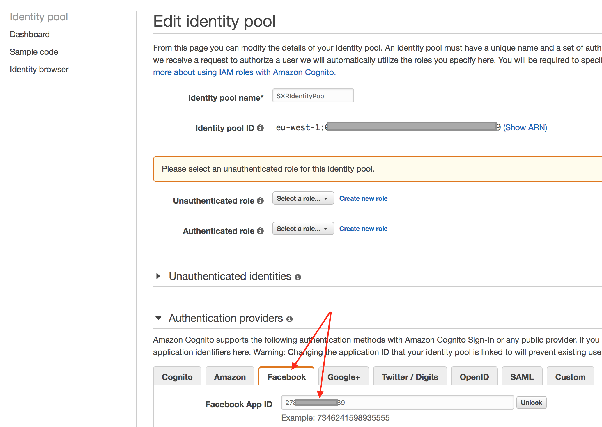

## 3. Configure and build the application code

Our application will need to know the location of the API in order to push and
pull data from it. In addition, the application will need to know our Facebook
App ID and Cognito Identity Pool ID so it can authenticate our users. 

All of these attributes must be configured in
`2_UI/src/environments/environment.ts`. Open this file inside AWS Cloud9 and edit
this file. Please be sure to address all of the parameters the file
requires or you will fail.  

You can obtain the Cognito Identity Pool ID from the *Outputs* of the CloudfFormation
template (`ticket-service-ui` stack) you deployed above.  Ensure that you copy the entire string,
including the AWS region (in this case, it should be `eu-west-1`)

If you used the console instructions to deploy Module 1,
then you can obtain the API Gateway Endpoint using the same method you used when you
tested at the end of the previous module. If you used the CLI instructions, you can obtaing the API Gateway Endpoit from the *Outputs* of the CloudfFormation template (`wild-rydes-api` stack). Ensure you do *NOT* append `ticket` to
the end of the URL but make sure you do have a `/` at the end like the comments in
the file request.

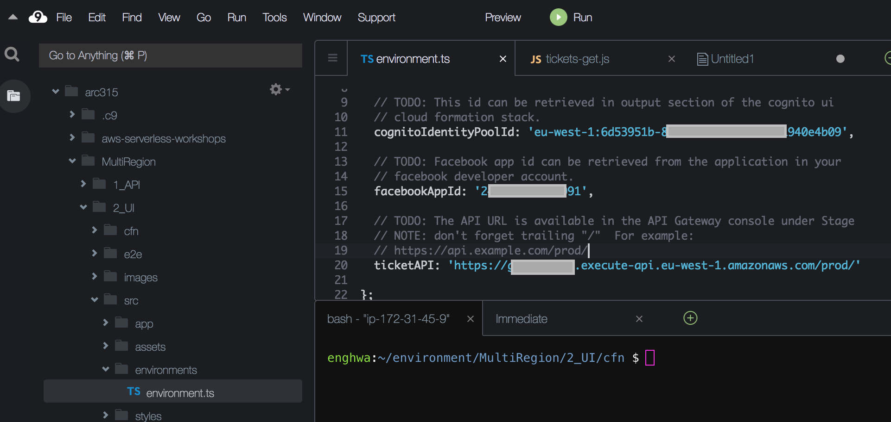

#### Build your AngularJS project

In your AWS Cloud9 shell, build your AngularJS project:
<!-- You will need Node Package Manager (NPM) installed on your local machine
(check out the [workshop prerequisites](../README.md#prerequisites)) in order
to build the application. You can follow instructions [Dev Instance
Setup](../README_InstallDevDependencies.md) to set up a dev instance. Once you
have created your dev instance build your project by executing the following: -->

- go to the root folder of the ui project, `cd /home/ec2-user/environment/MultiRegion-Serverless-Workshop/2_UI`
- run `npm install` to install project dependencies
- build your app with by running `npm run build`

If you get an error about NPM command not found, then go back and check the
[prerequisites section of the README](../README_Cloud9.md) to find instructions to install NPM.

This will produce a `dist/` folder containing the compiled application with your
custom settings.

## 4. Upload the application

Next, you'll need to upload the UI to the S3 website bucket specified in step 1. You can
do this with:

    aws s3 sync --delete dist/ s3://[bucket_name]

Note that you must replace `[bucket-name]` in this command with the bucket
name output from the CloudFormation stack in step 1.

#### Update Facebook App setting
Navigate back to Facebook App setting, update "App Domains" and "Privacy Policy URL" with the Cloudfront URL. Select any category (Example: Education). Toggle on the "Off" button at the top right corner to make the App public.

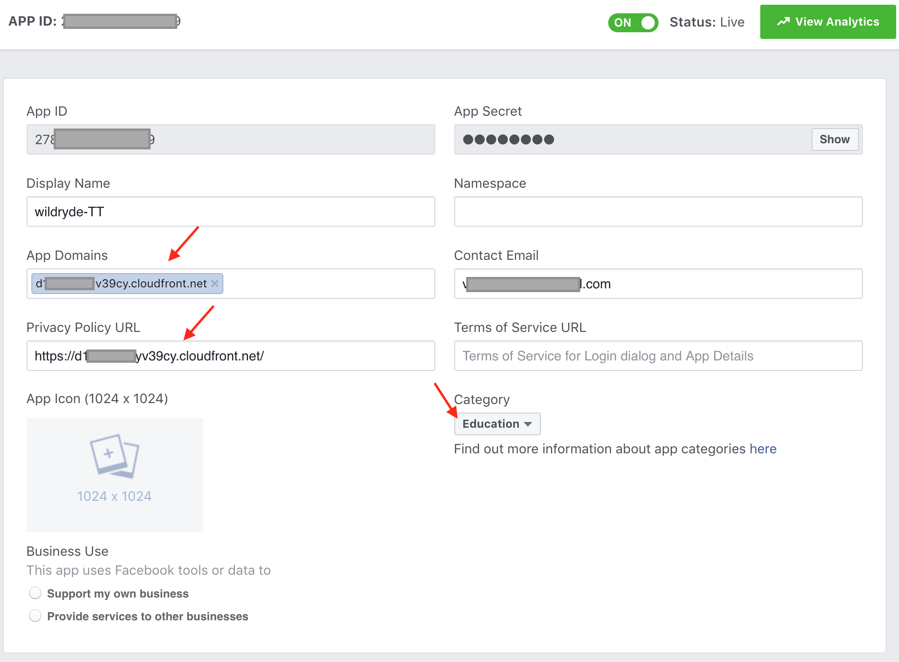

To confirm everything went as expected, navigate to your Cloudfront URL. You should see our
simple ticketing application. Go ahead and login using your Facebook account
and then submit a couple of tickets to check that everything is working.

If you have trouble in this step, double check your configured settings and
Facebook Developer account configuration. Note that if you change any
of the settings you will need to run *npm run build* again and then upload the website
code to your S3 bucket again.

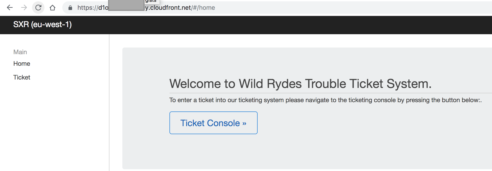

## Completion

Congratulations! You have successfully deployed a user interface for our users
on S3. In the next module you will learn how to configure active/active using Route53.

Module 3: [Configure Active-Active Route53](../3_Route53/README.md)
