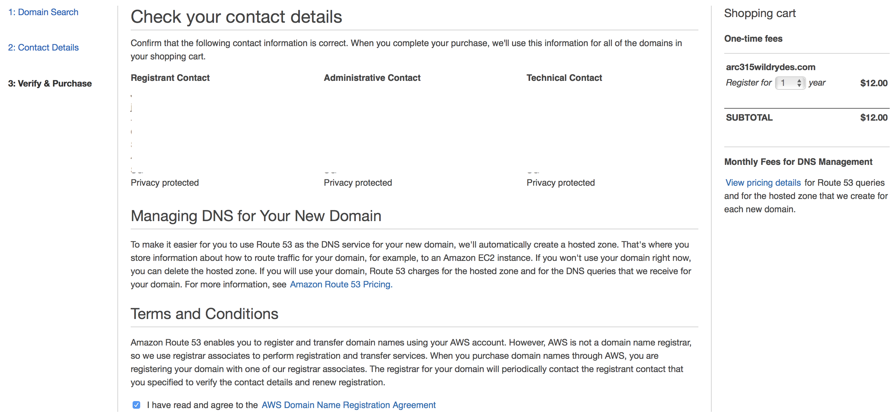
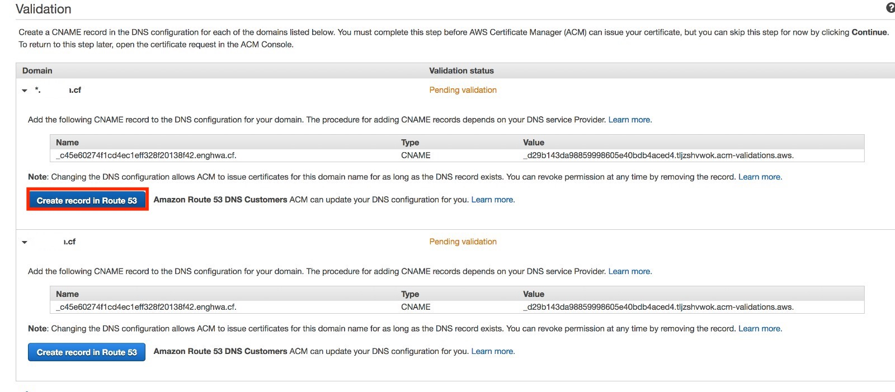
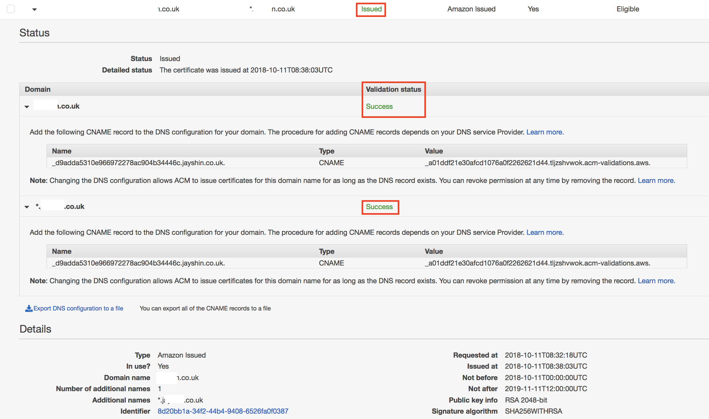
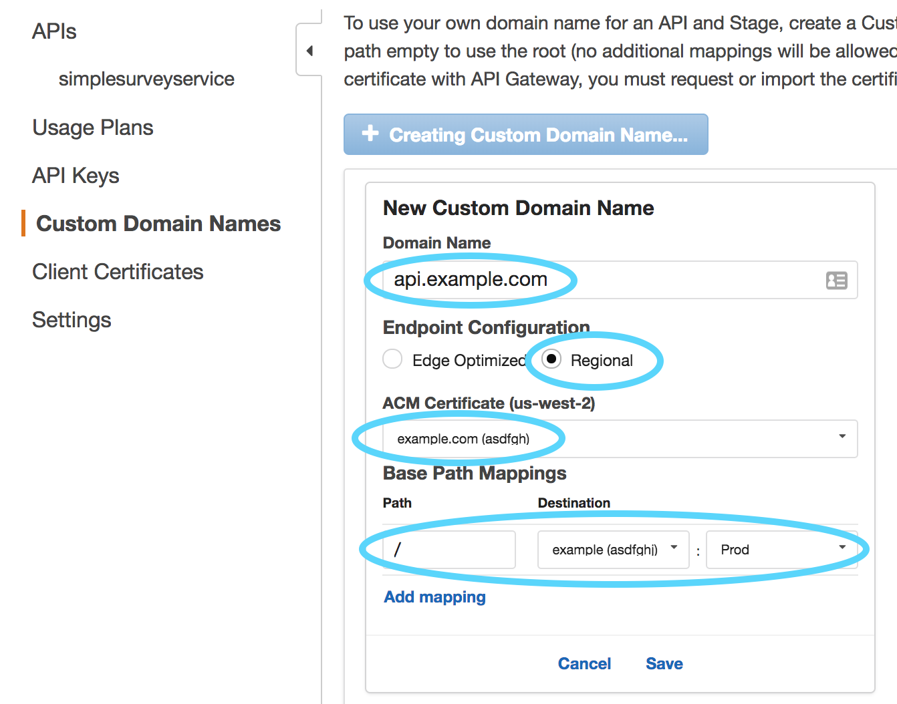
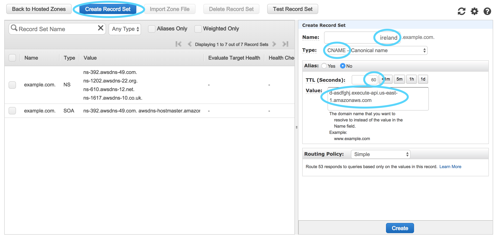
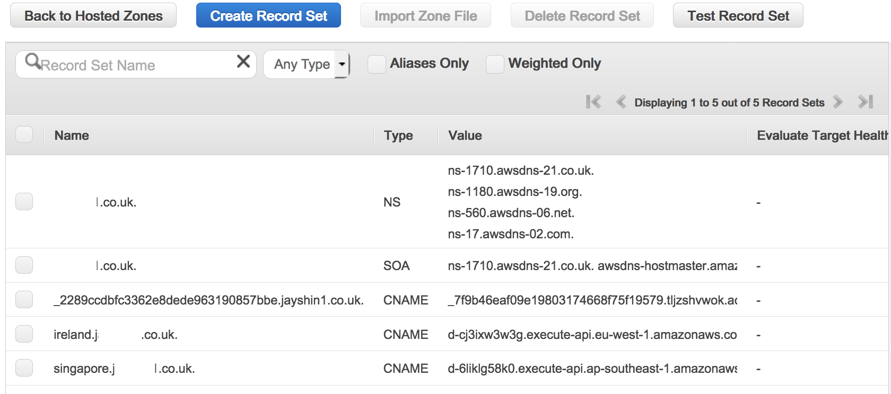
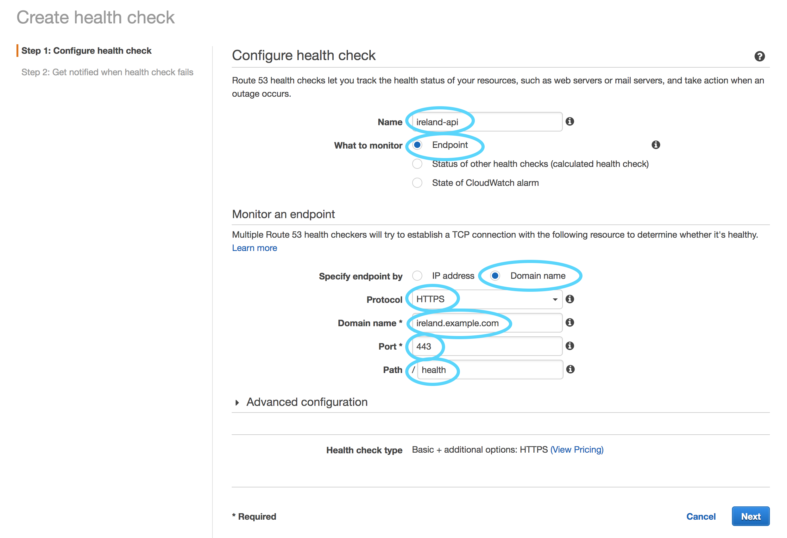
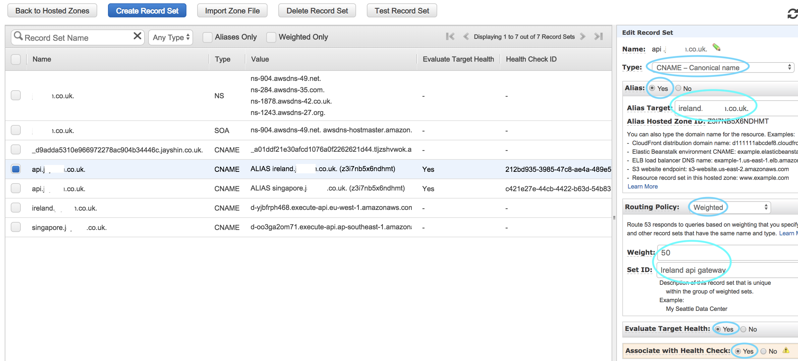
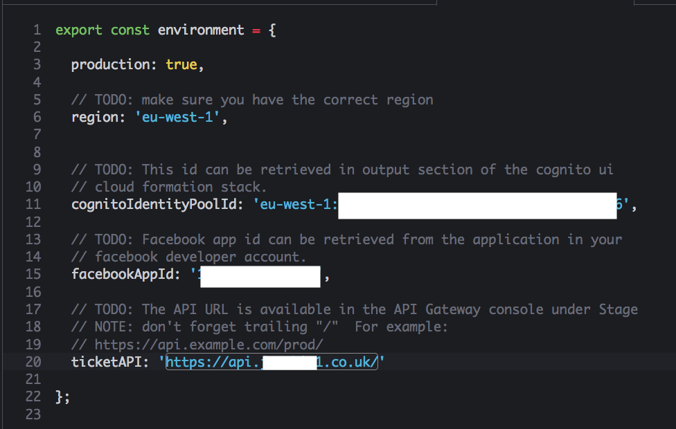

<!-- # Replicate to a second region --> 
# Configure Active-Active Route53

Now that we have the app set up, let's configure Route53 for active-active multi-region solution. 
<!-- 
For this workshop, we replicated the API layer on both regions, but leaving the UI in a single region (Ireland).
replicate this in a second region so we
have something to failover to. For this workshop, we will focus on the API
layer down, leaving the UI in a single region. --> 

## 1. Configure Route53 Domain

We need a way to be able to failover quickly with minimal impact to the
customer. Route53 provides an easy way to do this using DNS and healthchecks.
Be aware that some steps in this module will take time to go into effect
because of the nature of DNS. 

<!--NOTE: You will need the latest AWS CLI for this. Ensure you have updated
recently. See http://docs.aws.amazon.com/cli/latest/userguide/installing.html
-->

### 1.1 Purchase (or repurpose) your own domain

In this step, you will provision your own domain name for this
application. If you already have a domain name registered with Route53 and
would like to use this you can use skip to the next step.  It is also possible
to delegate DNS for a domain you own with another registrar to Route53 - simply
create the zone in Route53 and then use the four DNS entries generated by
Route53 back to to delegate the zone with your existing registrar. If using an existing 
domain name, ensure there is no CloudFront distribution already setup for the domain. 
<!--You will also need to ensure that your email
contacts are configured and up-to-date on the domain's SOA/registration records
since you may need to receive an approval e-mail in the next step.-->

#### High-level instructions

Navigate over to the Route53 Console and under **Registered domains** select
**Register domain** and follow the instructions. You will first have to find
an available domain before specifying your contact details and confirming the
purchase.

1. Navigate to the **Route53** service page
2. Navigate to **Registered domains**
3. Select **Register domain**
4. Enter the domain name you would like to use. You will have to choose
   something not already registered. Click **Check** and confirm that your
   domain is available before clicking **Add to cart**. Now choose
   **Continue**.
5. Enter your contact information. Ensure that you enter an email address
   where you can receive mail. By default, Route53 will enable privacy
   protection and configure an anonymized email address that forwards any mail
   onto the email address you specify. Leave this option selected and select
   **Continue**
6. Confirm that all your details are correct. Check the box agreeing to the
   terms and conditions. You will see that Route53 is verifying the email
   address you specified. Make sure you receive this email and complete the
   verification before proceeding.
7. Click **Complete Purchase**

It will take around 10 mins to register your domain. You will configure a certificate in
AWS Certificate Manager and a health check in Route53 later. 

For the remainder of this workshop we will use `example.com` as to
demonstrate. Please substitute your own domain into any commands or configurations.

<!-- ## 2. Replicate the primary API stack

For the first part of this module, all of the steps will be the same as module
1_API but performed in our secondary region (AP Singapore) instead. Please follow
module 1_API again then come back here. We suggest using the CloudFormation templates
from that module to make this much quicker the second time.

**IMPORTANT** Ensure you deploy only to *Singapore* the second time you go through
Module 1_API

* [Build an API layer](../1_API/README.md)

Once you are done, verify that you get a second API URL for your application from
the *outputs* of the CloudFormation template you deployed. -->

<!-- ## 3. Replicating the data

So now that you have a separate stack, let's take a look at continuously
replicating the data in DynamoDB from the primary region (Ireland) to the
secondary region (Singapore) so that there is always a backup.

We will be using a feature of DynamoDB Global Tables for this. Any changes 
made to any item in any replica table will be replicated to all of the other 
replicas within the same global table. In a global table, a newly-written item is 
usually propagated to all replica tables within seconds.

However, conflicts can arise if applications update the same item in different 
regions at about the same time. To ensure eventual consistency, DynamoDB global tables 
use a “last writer wins” reconciliation between concurrent updates, where DynamoDB makes 
a best effort to determine the last writer. 

You can test to see if it is working by creating a new ticket in the UI you deployed 
in the second module.  Then, look at the SXRTickets table in *source* region (double check this) DynamoDB and the DynamoDB table in your *secondary* region, and see if you can see the record
for the ticket you just created. --> 

## 2. Configure ACM and Custom Domains in API Gateway

### 2.1 Configure a certificate in Certificate Manager in each region

We will need an SSL certificate in order to configure our domain name with API
Gateway. AWS makes this simple with AWS Certificate Manager.

#### High-level instructions

Navigate over to the *Certificate Manager* service and request a new
certificate for your domain. You will specify the domain name you just created
(or repurposed). Make sure to request a wildcard certificate which includes
both `example.com` and `*.example.com`. You will have to approve the certificate request
by creating a special DNS record  - follow those directions if you choose to purschase your 
own domain via Route 53.

1. Ensure you are in your primary region, eu-west1.
2. Navigate to the **Certificate Manager** service page
3. Click **Provision certificates** and select **Request a certificate** and **Request a public certificate**
4. In this next step you will configure the domain name you just registered
   (or repurposed). You will want to add two domains to make sure you can
   access your site using subdomains. Add both `example.com` and
   `*.example.com`. The `*` acts as a wildcard allowing any subdomain to be
   covered by this certificate
5. Select **DNS validation** and click **Review**. Confirm both domains are configured and
   select **Confirm and request**
6. In the Validation screen, click **Create record in Route53**. The DNS records(CNAME and Value) was writen to your Route53 hosted zone.

7. Go to **Route 53** service console, and select the Domain Name that you created in **Hosted zones**. Confirm your Domain Name and the DNS records of certificate are created in the Record Set. Change the TTL to **60**, and click the **Save Record Set**. It will take about 10 mins, so you can keep the next steps first.<!-- 6. A validation email will be sent to the email address configured for the domain. Ensure that you received this email and click the validation link before moving on. Now click **Continue** (it is also possible to use DNS validation to issue the certificate as well - follow the instructions onthe screen if you choose/need to validate this way) -->
8. Repeat steps 2-5 again in your second region (Singapore). As the CNAME and Value of certificates are the same, hense, it will be automatically issued when the Ireland certification is confirmed.
9. Once the certificate validation is confirmed, it will appear as `Issued` in
your list of certificates.

### 2.2 Configure custom domains on each API in each region

Now that you have a domain name and a valid certificate for it, you can go
ahead and setup your APIs for each region to use your custom domain. API
Gateway Custom domains allow you to access your API using your own domain
name. While you can configure DNS records to point directly to the regular API
Gateway endpoint, an error will be returned unless you have this custom domain
configuration.

You will want two domain configurations in each Region. We will be using the
`api.` subdomain prefix for our application UI and `ireland.` and `singapore.`
to configure health checks and also so we can visit each region independently
for convenience.

* `eu-west-1` Ireland:
    * `api.example.com`
    * `ireland.example.com`
* `ap-southeast-1` Singapore:
    * `api.example.com`
    * `singapore.example.com`

#### High-level instructions

Navigate over to the **API Gateway** service, choose **Custom Domain Names**
then go ahead and configure a custom domain name for `api.example.com`. Make
sure to choose the **Regional** endpoint configuration. For the Base Path
Mappings, you choose `/` as the path and `prod` as the destination, then hit **Save**. 
If you get an error about rate
limits, wait a minute before attempting to create again.

Now repeat the process for :
**Ireland**
    * `ireland.example.com`
**Singapore**
    * `api.example.com`
    * `singapore.example.com`

Your newly-created Custom Domains will each show a Target Domain Name. You
will use this to configure your health checks and DNS records next. The final
configuration for the Ireland region should look similar to the below image.

## 3. Configure Route53 DNS records

### 3.1 Configure DNS records

Now let's start pointing your domain name at the API endpoints. In this step
you will configure CNAME records for your `ireland.` and `singapore.`
subdomains.

#### High-level instructions

<!--Make sure you are in your primary (Ireland) region.-->
Head over to the **Route53** service and select **Hosted zones**. Choose your domain name from
the list and you should see a couple of records already configured for
nameservers.

Select **Create Record Set** and create a new CNAME record for `ireland.`
pointing to the Target Domain Name for your corresponding API Gateway Custom
Domain from the previous step. You can set the TTL to 1m (60 seconds) for the
purpose of this workshop.  We recommend setting ALL DNS entries to 1m (60 seconds)
as the TTL.

Now repeat in your second region to create a CNAME for the `singapore.`
subdomain with the Target Domain Name for Singapore.

At this point you should now be able to visit your subdomain and see your API
working. Navigate to the health check endpoint on your API using your custom
domain in your web browser (e.g. `https://ireland.example.com/health`) and
ensure that you see a successful response.

This endpoint should return the region it is running in so you can also
confirm that this response region matches up with the domain you have
configured. Notice how we're explicitly using HTTPS. It may take a few minutes for your records to
become active so check back later if you do not get a response.

### 3.2 Configure a health check for both regions

In this step you will configure a Route53 health check on both
(Ireland, Singapore) regional endpoints. This health check will be responsible for
triggering a failover between the 2 regions if a problem is detected in the
one region.

<!--Note that if you were configuring an active-active model with something like
Weighted Routing then you would configure a health check on all endpoints, but
only one is necessary in this case since only our primary region will be
handling traffic under normal conditions.-->

#### High-level instructions

Navigate over to the **Route53** service and choose **Health checks**. Create
a new health check, give it an easily identifiable name e.g. `ireland-api`.
Under *Monitor an endpoint*, specify the endpoint by domain name.

Since our API is protected by a TLS certificate you will need to change the
port to 443 and the protocol to HTTPS.

You will also want to specify `/health` as the path as this is where our deep
ping health check Lambda function is served from.

Before saving this health check, expand the *Advanced configuration* section, and
change the *Request Interval* to `Fast (10 seconds)` and set the failure threshold
from *3* down to *1*.  This will greatly speed up the time you need for testing
and failing over (this is not a recommended production configuration but it is
useful for speeding up the remainder of this Workshop).

Once configured, wait a few minutes and you should see your health check go
green and say Healthy in the console. Make sure this is green and healthy
before proceeding.

Do the same for the Singapore region’s health check API. Once complete, you should be 
able to see the health status turn to green in the health checks in Route 53.

### 3.3 Configure DNS Routing Policy

Now let's configure the zone records for our `api.` subdomain prefix. You will
configure these as CNAME ALIAS records in a weighted pattern using
your health check for Multi-region active-active backend.

**Note.** To create records for complex routing configurations, you can also use the traffic flow 
visual editor and save the configuration as a traffic policy. However, we use the routing policy
for this workshop, as it is not possible to create an Alias record pointing to a DNS name that is 
being managed by a traffic policy.

#### High-level instructions

Navigate over to the **Route53** service and choose **Hosted zones**. Choose the zone for your
domain and select **Create Record Set**. Enter `api` as the name and choose
CNAME as the type. Now change Alias to `Yes` and select the `ireland.` prefixed
version of your domain. Since this is an alias, it should appear in the
dropdown list.

Next, choose the Weighted routing policy. You can select a value that determines 
the proportion of DNS queries that Route 53 responds for your Ireland record. (ex. 50)
Turn on both Evaluate Target Health and Associate with Health Check then select the `ireland-api` 
health check you created previously. Hit **Create**.

**Note.** Weighted routing lets you associate multiple resources with a single 
domain name (example.com) or subdomain name (acme.example.com) and choose how much 
traffic is routed to each resource. 

You will now want to repeat this step again but for your Singapore domain. 

Your completed DNS configuration should look something like the screenshot
below.

With the DNS configured, you should now be able to visit the `api.` prefix of
your domain (remember to use HTTPS). Go to the `/health` path and notice which 
regions is served based on Weighted routing policy.

## 4. Update your UI with new API Gateway Endpoint

Now that we have completed active-active configuration, you will need to change the API
endpoint in your *2_UI/src/environments/environments.ts* file to use our newly
created DNS name for our API endpoint.

Edit the *environments.ts* file and use `https://api.example.com/` (substituting your
own domain) instead of the region specific name you used when setting up and
testing the UI in the second module.

**IMPORTANT** This new API Endpoint URL does NOT have `/prod/` at the end.

Ensure you run `npm run build` from the *2_UI* directory, and then upload the */dist*
contents to the S3 bucket using the same *aws s3* command you used in the second module. ie:

    aws s3 sync --delete dist/ s3://[bucket_name]

## Completion

Congratulations you have configured a multi-region API and set up a
healthcheck-based Weighted routing policy using Route53. In the next module we will
intentionally break the primary region (Ireland) and verify that the second region (Singapore) works.

Module 4: [Test failover](../4_Testing/README.md)
